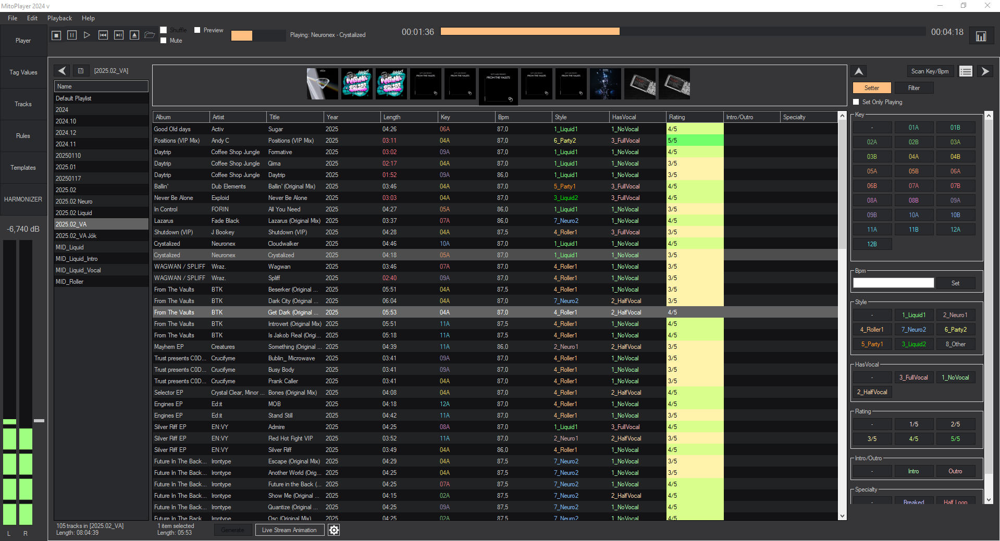
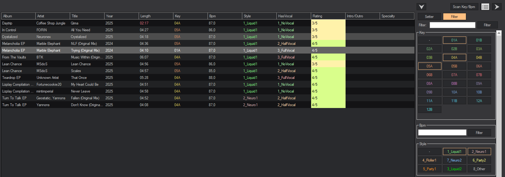
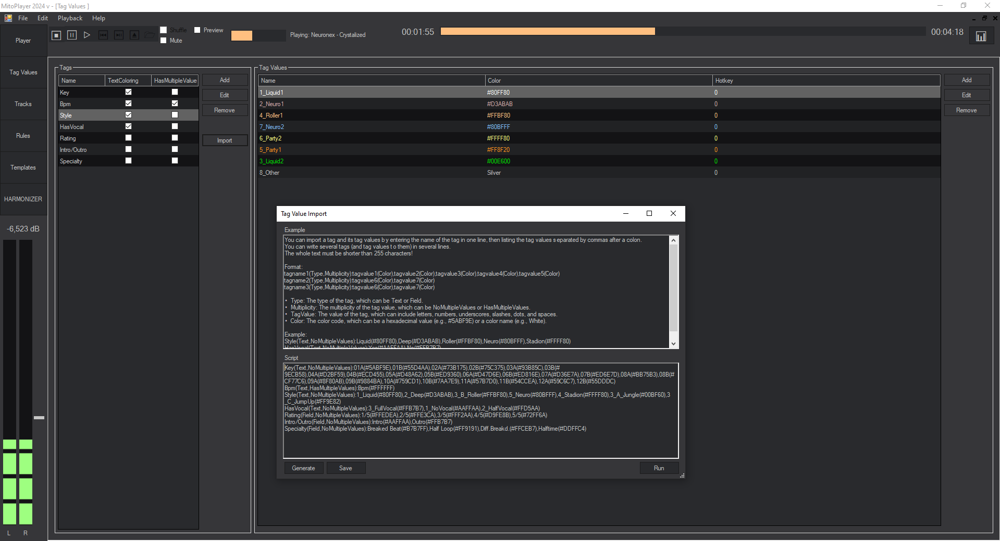
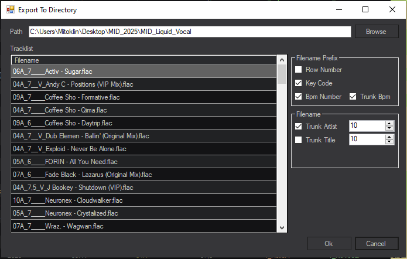

  

<h1 align="center">MitoPlayer 2024</h1>

  A smart playlist assistant and custom MP3 player for DJs, focused on harmony and metadata-driven mixing.

# MitoPlayer 2024

**Custom MP3 player and playlist assistant for DJs**, designed to organize large music libraries, assign rich metadata, and generate harmonically compatible playlists — faster and more intuitively than traditional tools.

## 🎧 Why I built it

As a DJ, I needed a tool that helps me manage my music with custom properties like tone, BPM, vocal presence, and more. MitoPlayer lets me filter, organize, and preview tracks in a clean interface — with full control over playlist generation.

Originally built in Java/Swing, the app was rewritten in 2024 using **C# (WinForms)** and **MySQL** for better performance and extensibility.

---

## ✨ Features

- 🎵 MP3 playback & playlist management  
- 🔑 BPM and key import (MixedInKey / VirtualDJ)  
- 🏷️ Custom metadata (tone, BPM, vocals, intro length, style, etc.)  
- 🧠 Advanced filtering & tag-based rules  
- 🖼️ Album cover browsing  
- 🎚️ VirtualDJ integration (live info display)  
- 📦 Track export & batch renaming  
- 🖱️ Drag-and-drop support with other DJ tools  
- 📋 Tag management with color coding  
- ⚙️ Rule system and template-based playlist generation *(coming soon)*  

---

## 📸 Screenshots

### Main Interface

### Filter & Tag View

### Tag Editor

### Export Dialog

---

## 🔧 Tech Stack

- C# (.NET 6)
- WinForms UI
- MySQL backend
- VirtualDJ / MixedInKey integration

---

## 🚧 Roadmap

- [ ] Playlist templates based on harmony rules  
- [ ] Full auto-mode playlist builder  
- [ ] Smart recommendations  
- [ ] Custom audio preview control  

---

## 📬 Contact

Feel free to reach out or open an issue if you're interested in using or contributing to the project.
